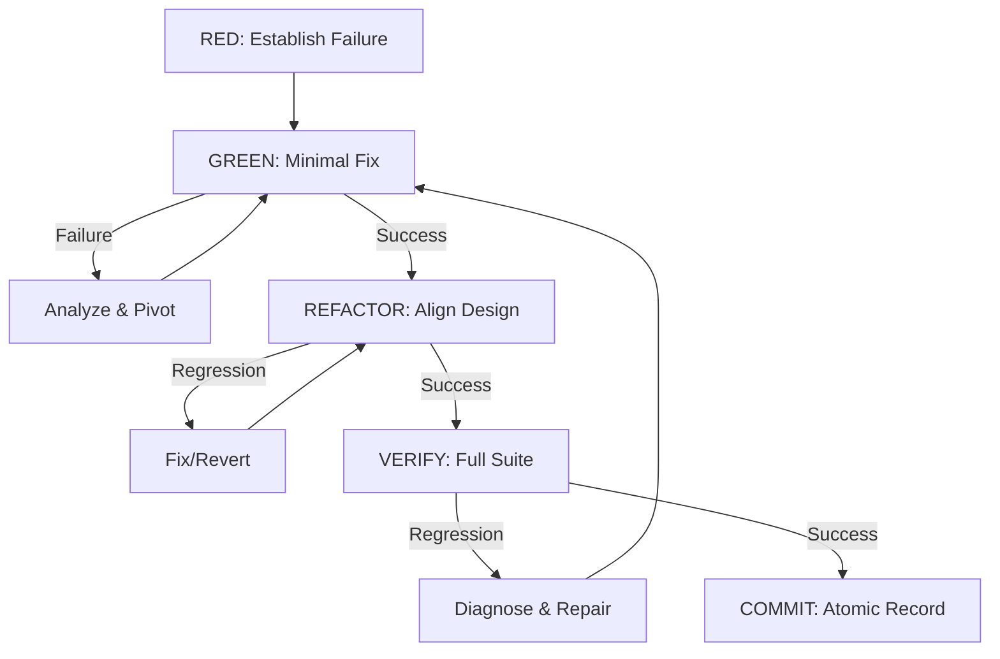

# Definition of Done: Agentic TDD Protocol

**Purpose:** Establish a high-autonomy execution framework where progress is measured by the completion of full TDD cycles (RED → GREEN → REFACTOR → VERIFY → COMMIT) without intermediate yielding to the user.

**The Golden Rule:** Do not return control to the user until a full TDD cycle is successfully committed, or until you have exhausted at least three distinct automated attempts to resolve a blocker.

---

## 1. The Atomic TDD Cycle

The agent must treat the following sequence as a single, uninterruptible unit of work:

---

## 2. Agentic Execution Directives

### 2.1 Minimize Yielding
*   **Avoid Intermediate Status Reports:** Do not return to the user just to say "I have created the test" or "The test is now passing." Keep going until you reach `COMMIT`.
*   **Handle Errors Internally:** If `make` fails or a test crashes, use your tools (grep, view_file, list_dir) to diagnose and fix it immediately.
*   **Batch Tool Calls:** Combine logic to move through phases in the fewest possible turns.

### 2.2 Persistence and Self-Correction
*   **The 3-Attempt Rule:** If a fix fails to turn the test GREEN, you must attempt at least two alternative implementations (e.g., trying a different grammar rule, changing a data structure, or adjusting a lexer pattern) before reporting failure.
*   **Reversion over Stagnation:** If a REFACTOR phase introduces complex regressions that you can't solve in 5 minutes, `git checkout` the affected files and try a simpler refactor or skip to COMMIT.

### 2.3 Context Preservation
*   Maintain a local "Scratchpad" (commented at the top of your main working file if necessary) to track your progress through the cycle, but do not make this the user's problem until the end.

---

## 3. Phase Definitions (Agentic Focus)

### Phase 1: RED (Establish Failure)
*   **Agent Goal:** Get a tool-verifiable failure.
*   **Done when:** `make test` (or specific runner) produces a non-zero exit code or specific error message linked to the task.
*   **Action:** Write the test, run it, confirm it fails for the right reason.

### Phase 2: GREEN (Localize Fix)
*   **Agent Goal:** Rapidly reach a passing state.
*   **Strategy:** Implement the "ugliest" working version if necessary. You are empowered to modify any necessary source files.
*   **Done when:** The specific test passes.

### Phase 3: REFACTOR (Theory Alignment)
*   **Agent Goal:** Clean the code without breaking the pass.
*   **Directives:** Apply project-specific design patterns (e.g., "Logic-to-Grammar" in Bison projects). Ensure zero regressions in the target test.
*   **Done when:** Code meets aesthetic/architectural standards AND the test still passes.

### Phase 4: VERIFY (Zero Regressions)
*   **Agent Goal:** Protect the existing codebase.
*   **Mandatory Action:** Run the **FULL** test suite.
*   **Logic:** `New_Pass_Count >= Baseline_Pass_Count`. If less, you are in a "Repair Loop"—fix the regressions before moving to COMMIT.

### Phase 5: COMMIT (Atomic History)
*   **Agent Goal:** Permanent, clean record of progress.
*   **Action:** Stage all changes, write a high-quality imperative commit message, and execute the commit.
*   **Done when:** `git status` shows a clean working directory.

---

## 4. When to Return to User (Exception Handling)

The agent should ONLY yield control before Phase 5 if:
1.  **Ambiguity:** The requirements for the RED phase are fundamentally contradictory or missing.
2.  **Infrastructure Failure:** A tool (compiler, linter, test runner) is broken in a way that is external to the codebase (e.g., missing system dependency).
3.  **Exhaustion:** You have tried 3+ distinct approaches to a fix and all have failed or introduced worse regressions.
4.  **Completion:** The TDD cycle is committed and you are ready for the next task.

---

## 5. Success Metrics for "Done"

| Metric | Requirement |
| :--- | :--- |
| **Cycle Integrity** | Full RED-to-COMMIT completed in one response sequence. |
| **Test Pass Rate** | 100% (No regressions allowed). |
| **Commit Quality** | Clear message, atomic changes, no lint errors. |
| **Code Style** | Aligned with project conventions (Variable naming, spacing). |

---

**Protocol Version:** 2.0 (Agentic Priority)
**Last Updated:** February 4, 2026
**Status:** ACTIVE - Apply to all coding tasks.
